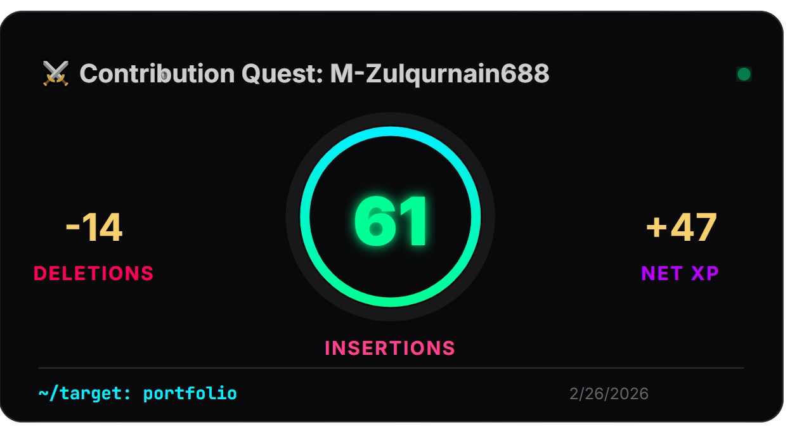

# ⚔️ Contribution Quest Card

A gamified, real-time GitHub activity tracker that transforms your latest commit data into a dynamic "Quest Card." Showcase your coding velocity, insertions, and deletions with a sleek, neon-animated interface.


## Preview
<div align="center">
  
</div>

## 🚀 Live Preview
<div align="center">
  
</div>

## ✨ Features
- **Live Pulse:** Real-time data fetching from the GitHub Events API.
- **Animated Progress:** Circular SVG ring that "powers up" on every load.
- **Auto-Scaling:** Handles huge contribution numbers (1,000+) without breaking the layout.
- **Dark Mode Aesthetic:** Designed to blend perfectly into GitHub Profile READMEs.

## 🛠️ Installation & Usage

### 🚀 Quick Start (Use Mine!)

You don't need to deploy anything to use this on your profile. Simply copy the code below and change `YOUR_USERNAME` to your **GitHub Username**:

```markdown
[](https://github.com/M-Zulqurnain688/contribution-quest-card)

```

### 1. Deployment
This project is optimized for **Vercel**. 
1. Fork or create a private repository with the provided structure.
2. Connect your repository to Vercel.
3. Add your `GITHUB_TOKEN` in the **Environment Variables** settings.

### 2. Integration
Add the following Markdown to your GitHub Profile README. Replace `YOUR_VERCEL_URL` and `YOUR_USERNAME`:

```markdown


```

## 🎨 Customization

You can change the accent color by passing a hex code (without the `#`) in the URL:

* **Neon Green:** `?color=00FF94`
* **Cyber Blue:** `?color=00F0FF`
* **Vivid Purple:** `?color=BD00FF`

## 🔒 Security & Privacy

To maintain professional security standards:

* **Private Logic:** The core engine is hosted as a serverless function.
* **Token Safety:** Personal Access Tokens are stored as encrypted environment variables on Vercel and are never exposed to the client.
* **Data Access:** The card displays public activity for all users. Private repository stats are only visible if the card is used by the token owner.

## 🏗️ Project Structure

```text
└── 📁github_contribution
    └── 📁api
        ├── .env           # Local Secrets (Git Ignored)
        ├── index.js       # Express Serverless Logic
    ├── package.json       # Dependencies
    └── vercel.json        # Vercel Deployment Config

```

```markdown
## 🔍 Technical Note: The 90-Day Logic
To keep the "Quest" relevant to your current journey, this card pulls data from the **GitHub Events API**. 
- It tracks activity from the **last 90 days**.
- It focuses on **recent velocity**, meaning old repositories you haven't touched in years won't affect your current "Battle Stats."
---

<div align="center">
Made with ❤️ and ⚔️ by <a href="https://github.com/M-Zulqurnain688">M-Zulqurnain688</a>
</div>